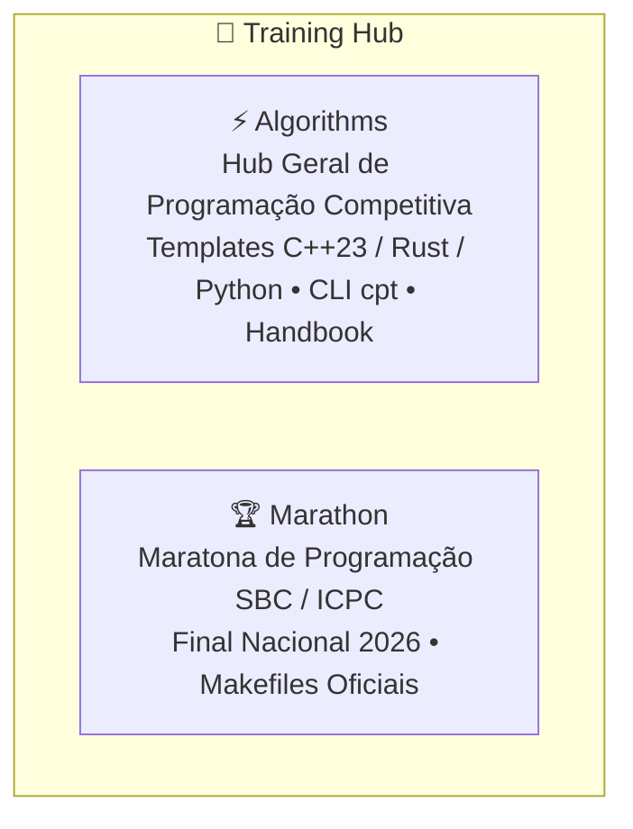

# 🎯 Training Hub

> **Orquestrador Federado de Programação Competitiva, Algoritmos & Maratonas**<br />
> _O laboratório de alto rendimento algorítmico de Gabriel Frigo (Equipe GRUB - UFABC)._

<div align="center">

[](LICENSE)
[](Algorithms/)
[](https://codeforces.com/profile/Gerbunte)
[](https://github.com/GabrielFrigo4/training/actions/workflows/submodules.yml)
[](https://github.com/GabrielFrigo4)

</div>

---

## 📖 Visão Geral

O repositório **Training** centraliza o ecossistema de algoritmos e preparação competitiva. Ele reúne os templates, ferramentas de automação de testes sob restrições extremas de tempo e memória, e o treino direcionado para maratonas oficiais de programação:



---

## 🧩 Os Componentes do Training

| Componente                      | Foco & Responsabilidade                                                             | Tecnologias Centrais                   | Repositório Remoto                                                              |
| :------------------------------ | :---------------------------------------------------------------------------------- | :------------------------------------- | :------------------------------------------------------------------------------ |
| [**`Algorithms`**](Algorithms/) | Templates, handbook de algoritmos e resoluções para Codeforces, AtCoder, OBI e CSES | C++23, Python 3.12, Rust, Bash (`cpt`) | [`GabrielFrigo4/cp-training`](https://github.com/GabrielFrigo4/cp-training)     |
| [**`Marathon`**](Marathon/)     | Treino oficial para a Maratona SBC / ICPC focado na Final Nacional 2026             | C++23, POSIX Makefile, GCC             | [`GabrielFrigo4/icpc-training`](https://github.com/GabrielFrigo4/icpc-training) |

---

## 🚀 Como Obter e Operar

```sh
# Clonagem recursiva
git clone --recursive "https://github.com/GabrielFrigo4/training.git"
cd training

# Ou clonagem simples seguida de bootstrap
git clone "https://github.com/GabrielFrigo4/training.git"
cd training
make clone
```

### Operações com o Makefile

```sh
make status    # Verifica estado de sincronização dos submódulos
make pull      # Atualiza com as branches principais remotas
make test      # Executa sanity checks e scripts locais
```

---

## 📜 Governança e Princípios

- **Princípios de Engenharia:** Consulte [PRINCIPLES.md](PRINCIPLES.md) para os 18 princípios canônicos aplicados.
- **AI Agent Briefing:** Instruções de operação para agentes autônomos em [AGENTS.md](AGENTS.md).
